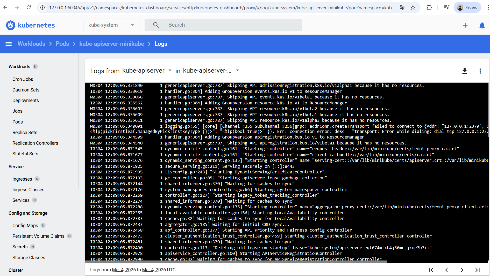
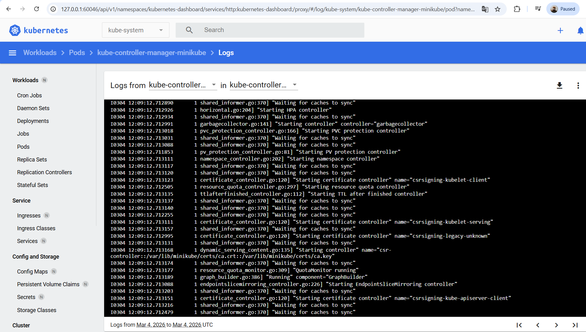

# DevOps Assignment – Kubernetes Cluster & Secure Docker Image

## Overview

This repository contains the implementation of two DevOps tasks demonstrating containerization, Kubernetes cluster operations, and secure container image design.

### Tasks Implemented

1. **Kubernetes Task** – Build and operate a single-node Kubernetes cluster and visualize cluster resources using a GUI.
2. **Docker Task** – Build a secure Docker image for a simple Python application while applying container security best practices.

This project demonstrates practical DevOps capabilities including:

* Kubernetes cluster provisioning
* Cluster observability using GUI tools
* Container image creation
* Secure container design
* Reproducible environment setup

---

# Repository Structure

devops-assignment

docker-task
├── Dockerfile
└── app.py

kubernetes-task
└── screenshots
├── kube-apiserver-logs.png
└── kube-controller-manager-logs.png

README.md

---

# Task 1 – Kubernetes Cluster Setup

## Objective

Create a **single-node Kubernetes cluster** and deploy a GUI tool to visualize cluster resources without relying directly on kubectl for visualization.

---

# Tool Used

### Minikube

Minikube is a lightweight Kubernetes distribution used for local development and testing.

It provisions a **single-node Kubernetes cluster** containing both control-plane and worker components.

---

# Kubernetes Architecture

The cluster contains the following components:

### Control Plane

* kube-apiserver
* kube-controller-manager
* kube-scheduler
* etcd

### Node Components

* kubelet
* kube-proxy
* container runtime (Docker)

---

# Cluster Setup

Start the cluster:

```
minikube start --driver=docker
```

Verify the node:

```
kubectl get nodes
```

Expected output:

```
minikube   Ready   control-plane
```

---

# GUI Tool Deployment

The **Kubernetes Dashboard** is used to visualize cluster resources.

Start dashboard:

```
minikube dashboard
```

The dashboard provides visibility into:

* Nodes
* Pods
* Deployments
* Namespaces
* Logs
* Events

---

# Viewing Control Plane Logs

Inside the dashboard:

Workloads → Pods → kube-system namespace

Key control plane pods observed:

* kube-apiserver
* kube-controller-manager
* kube-scheduler
* etcd

Logs for kube-apiserver and kube-controller-manager were accessed through the GUI.

---

# Screenshots

Control plane logs captured through the Kubernetes Dashboard.

 


---

# Verification

Cluster functionality verified using:

1. Node status showing **Ready**
2. Control plane pods in **Running state**
3. Dashboard successfully displaying cluster resources
4. Logs accessible through the GUI

---

# Task 2 – Dockerfile Implementation

## Objective

Create a Docker image that runs a simple Python application while following container security best practices.

---

# Application

app.py

```
print("Hello World")
```

---

# Secure Dockerfile

```
FROM python:3.11-slim

RUN useradd -m appuser

WORKDIR /app

COPY --chown=appuser:appuser requirements.txt .

RUN pip install --no-cache-dir -r requirements.txt

COPY --chown=appuser:appuser app.py .

USER appuser

CMD ["python", "app.py"]
```

---

# Security Best Practices Applied

### 1. Lightweight Base Image

The container uses the `python:3.11-slim` base image.

This image is significantly smaller than the full Python image and reduces the attack surface by excluding unnecessary packages and system utilities.

---

### 2. Non-Root Container Execution

A dedicated non-root user is created inside the container:

RUN useradd -m appuser

The container is executed using this user:

USER appuser

Running containers as a non-root user follows the **principle of least privilege**, preventing potential privilege escalation attacks and improving overall container security.

---

### 3. Secure File Ownership During Copy

Application files are copied into the container using the `--chown` flag:

COPY --chown=appuser:appuser requirements.txt .
COPY --chown=appuser:appuser app.py .

This ensures that application files are owned by the non-root user at the time of copying, eliminating the need for additional permission modification steps and improving build efficiency.

---

### 4. Dependency Management

Dependencies are installed using a `requirements.txt` file:

RUN pip install --no-cache-dir -r requirements.txt

Using `--no-cache-dir` prevents pip from storing unnecessary package caches, reducing image size and preventing leftover artifacts inside the container.

Managing dependencies through a requirements file also ensures **reproducible and consistent builds**.

# Build the Docker Image

```
docker build -t hello-python-app .
```

---

# Run the Container

```
docker run hello-python-app
```

Expected output:

```
Hello World
```

---

# Verify Container User

```
docker run --rm hello-python-app whoami
```

Expected output:

```
appuser
```

---

# Conclusion

This assignment demonstrates the following DevOps capabilities:

* Kubernetes cluster provisioning
* Cluster observability using Kubernetes Dashboard
* Container image creation
* Secure container design using least privilege principles
* Reproducible development environment setup

These practices align with standard DevOps workflows used in modern containerized environments.
